## Disclaimer:
The information has been taken from AWS Documentation during my preperation.

## Code Build
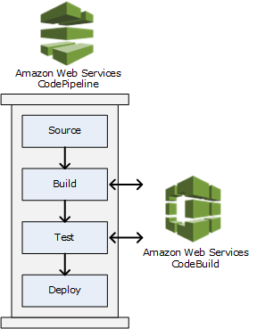

## AWS Organizations and SCP

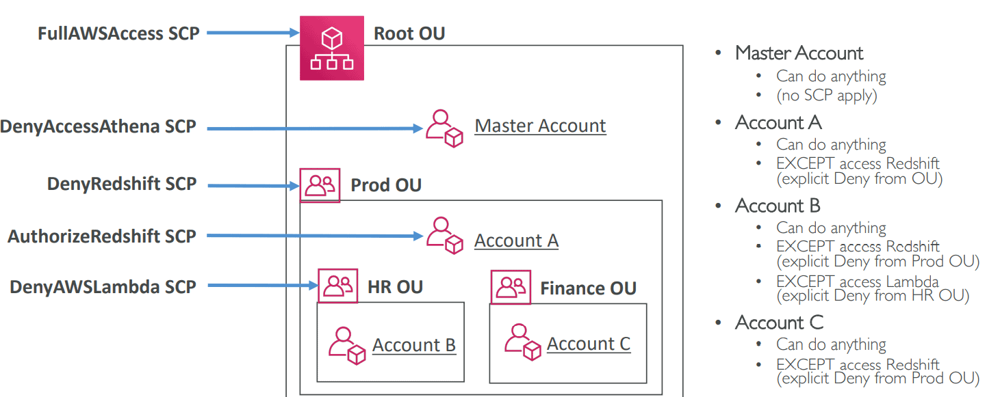

## EventBridge

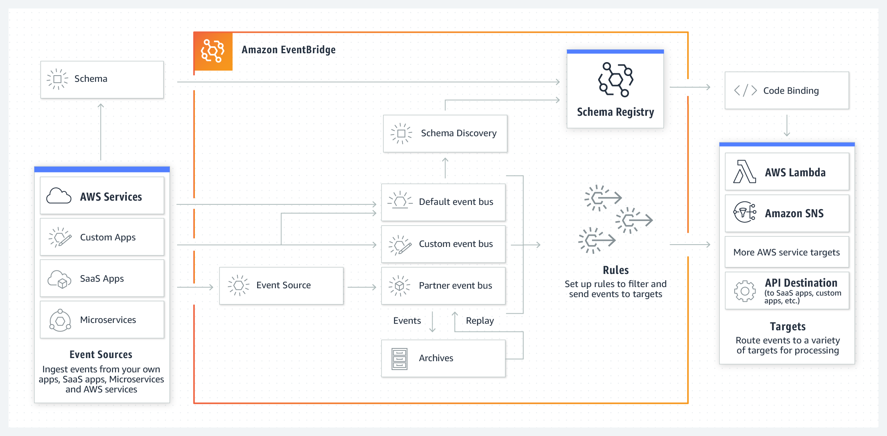

## CloudWatch

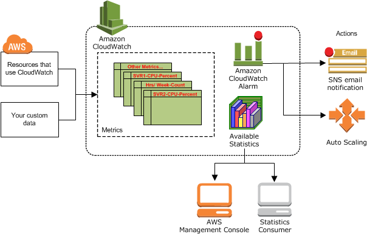

## Auto Scaling

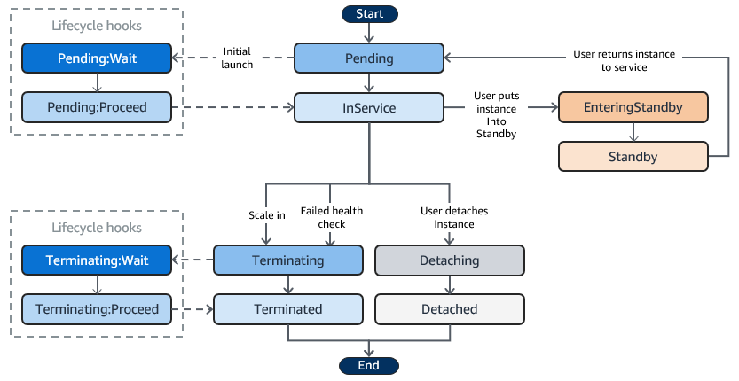

## Code Deploy: Deployment methods
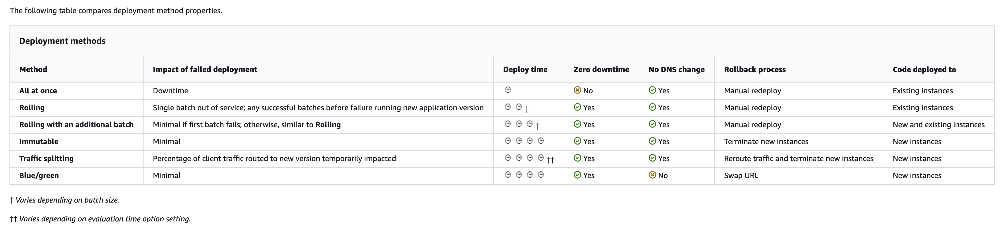

## Code Deploy: AppSpec 'hooks' section

> Note: The `gray` hooks can't be scripted.

#### Run order of hooks in a Lambda function version deployment
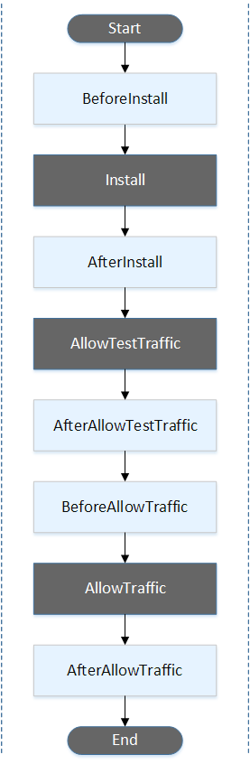

#### Run order of hooks in a Lambda function version deployment
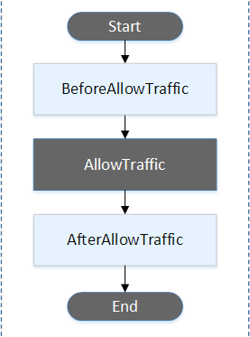

#### Run order of hooks in a deployment - Auto Scaling launch deployments
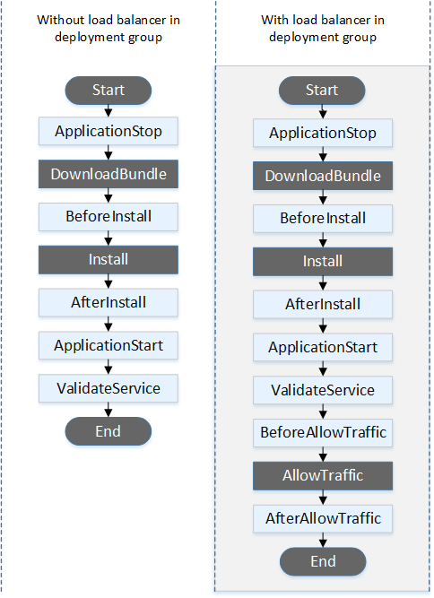

#### Auto Scaling termination deployments
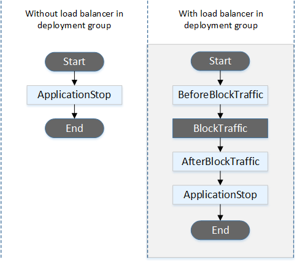

#### In-place deployments
> In an in-place deployment, including the rollback of an in-place deployment, event hooks are run in the following order:

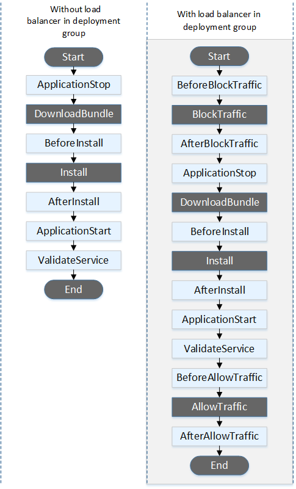

#### Blue/green deployments
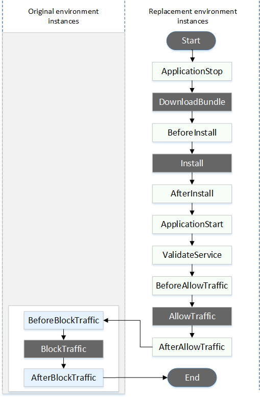

#### Blue/Green Deployment Methodology
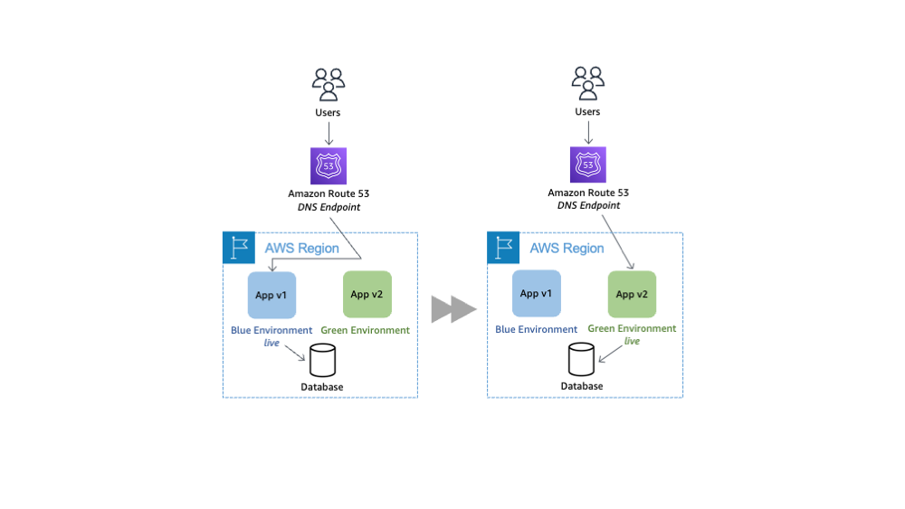

## A quick look at CodePipeline
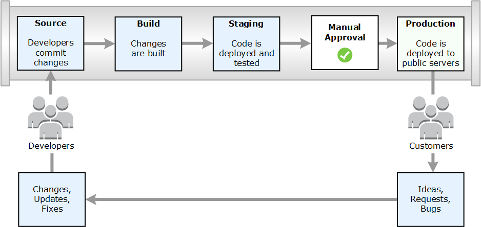
## AWS Firewall Manager
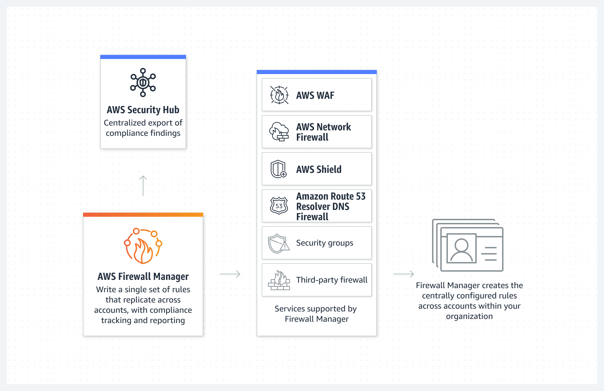

## How target tracking scaling works
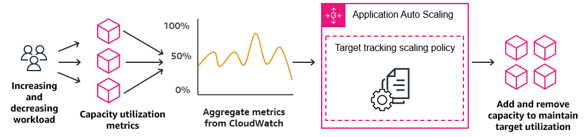

## DR - Pilot light
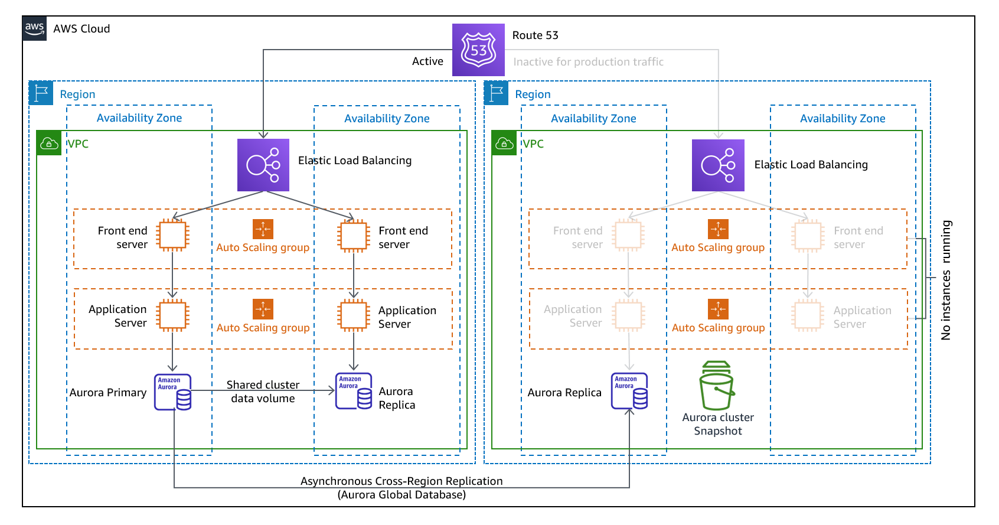

## CloudFormation StackSets
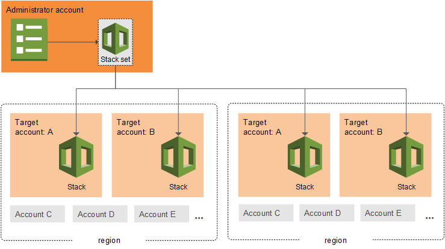

## CloudFormation Nested Stacks
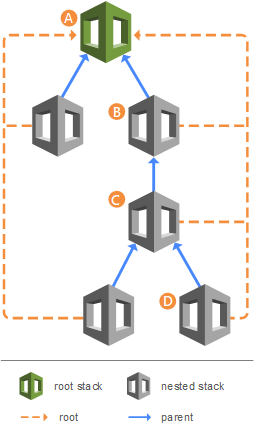

#### AWS Config Remediation
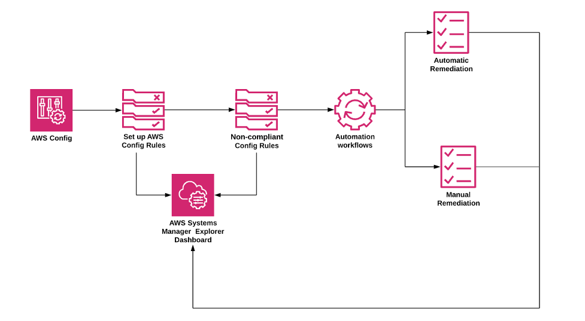