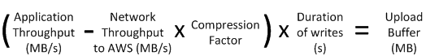

## Disclaimer:

The information has been taken from various sources during my preperation
1. https://learn.cantrill.io/
2. https://www.udemy.com/course/practice-exam-aws-certified-solutions-architect-professional/
3. https://www.udemy.com/course/aws-certified-solutions-architect-professional-training/
3. AWS Skill Builder - Advanced Architecting Course
4. AWS Documentation
5. AWS Exam Readiness - Live and Recorded 

#### Determining the size of upload buffer to allocate

